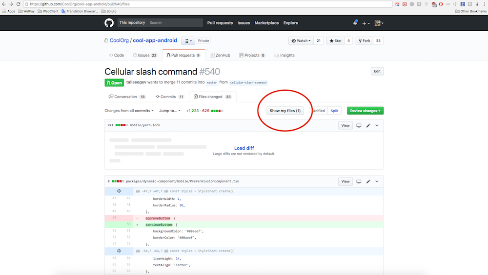
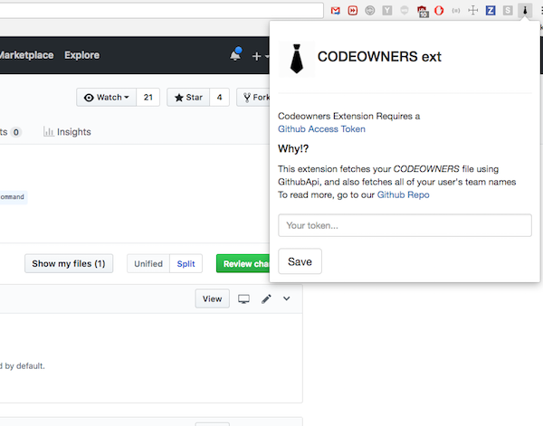

# codeowners-ext
Browser extension (Chrome) to easily code review with GitHub codeowners
Features:

- Filter out files that don't belong to you
- Works with teams as well
- Support for private repos (see below)

### Github Access Tokens for Private repos

Codeowners file fetches the PR, the `CODEOWNERS` file and your user's teams.    
It does this using the npm library [codeowners-api](https://github.com/code-owners/codeowners-api).    
Don't worry, we don't send anything anywhere, we store your token safely in the chrome storage.    
For this, it needs a github access tokens with these permissions:
* **repo** (Full control of private repositories)
* **user:read:user**

## Credits
Elay Gliksberg && Ore Poran
